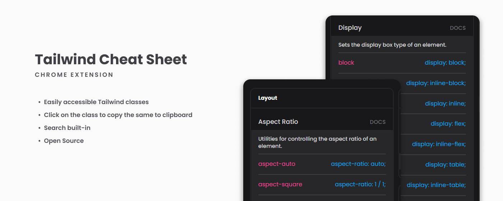

# Tailwind Cheat Sheet inside Chrome Extension

### Description

Have been using this chrome extension for my personal usage since a few weeks now. Decided to publish it to the chrome web store hoping it will be helpful to other as well.

This project was bootstrapped with [Create React App](https://github.com/facebook/create-react-app).

### Contribute to this Repo
- Feel free to raise any PRs for new features or existing issues

### Credits
- This extension uses JSON Dataset from [Tailwindcomponents.com/cheatsheet](https://tailwindcomponents.com/cheatsheet/)

### Do you have any questions?
Please reach out to me via my email "shahid.sk27595@gmail.com"

